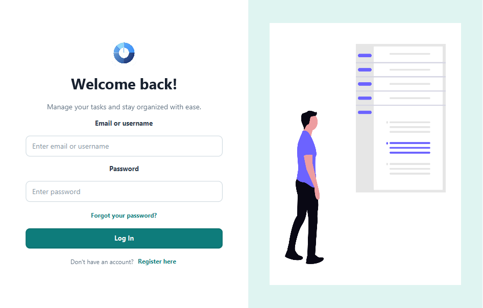
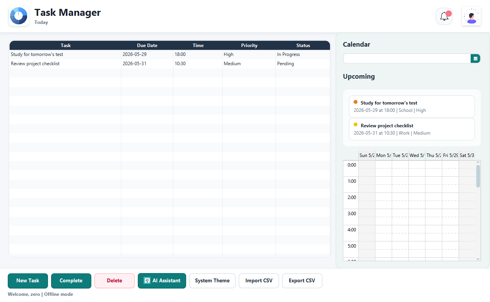
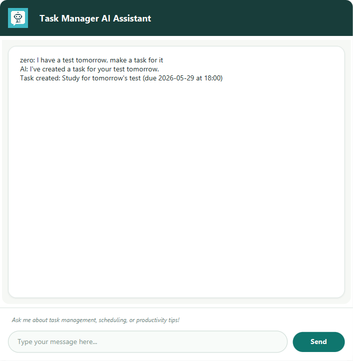

# Task Management System

A JavaFX desktop application for managing personal, school, work, and family tasks. The app supports task creation, editing, completion tracking, deletion, CSV import/export, reminders, calendar scheduling, profile pictures, system-aware themes, offline local storage, and optional Gemini-powered AI assistance.

## Key Features

- Create, edit, complete, and delete tasks.
- Track due dates, due times, priority, category, status, and optional reminders.
- View tasks in a table, calendar agenda, and upcoming-task preview.
- Import and export task data with CSV files.
- Receive local notifications for incomplete tasks due within 24 hours.
- Use automatic system theme detection, or manually choose light or dark mode.
- Continue using the app when the database is unavailable through local JSON storage.
- Use the AI assistant to plan work and create tasks when a Gemini API key is configured.
- Create simple tasks locally from clear AI-chat requests when Gemini quota is unavailable.
- Resume previous AI assistant conversations from saved local chat history.

## Application Walkthrough

This walkthrough follows the normal path through the app, from sign-in to daily task management and AI-assisted task creation.

### 1. Sign In Or Create An Account



Start from the login screen. Existing users can sign in with their username or email, and new users can create an account with a security question for password recovery. If the database is unavailable, the app continues in offline mode and stores tasks locally.

### 2. Review The Dashboard



After signing in, the dashboard shows the main task table, upcoming tasks, notification status, and the calendar agenda. The table is the primary workspace for reviewing task descriptions, due dates, due times, priorities, categories, and completion status.

### 3. Create And Manage Tasks

Use the task controls to add a new task with a description, due date, due time, priority, category, and optional reminder. Existing tasks can be edited, marked complete, or deleted. Changes refresh the table, upcoming-task preview, agenda, and notification indicator so the screen stays in sync.

### 4. Use The AI Assistant



Open the AI assistant when you want help planning or creating a task from natural language. For example, writing `I have a test tmr can you make a task for it` creates a study task due tomorrow. The app keeps one AI assistant window open at a time, reloads the user's previous chat history, and sends recent history as context so the conversation can continue naturally. If Gemini is unavailable because of quota, billing, or a temporary service issue, the app shows the real Gemini error and still tries to create a simple local task from clear requests.

### 5. Import, Export, And Personalize

CSV import helps bring existing task lists into the app, while export saves the current task list for backup or sharing. Profile-picture upload validates file type and location before saving. The theme follows the operating system by default, and users can manually switch between system, light, and dark modes.

### 6. Continue Offline

The app does not require the database for everyday task management. When the database is missing or unreachable, tasks are saved to the local JSON store and separated by the email address or username used at login.

## Requirements

- Java JDK 23 or newer
- Maven, or the included Maven wrapper
- Internet access only when downloading dependencies or using the optional AI assistant

## Running The App

```powershell
$env:JAVA_HOME = "C:\Program Files\Java\jdk-24"
.\mvnw.cmd javafx:run
```

The application starts with a splash screen, then opens the login screen. If database settings are missing or the database is unreachable, login and sign-up continue in offline mode.

## Configuration

Do not commit live credentials to source control. Configuration can be provided with environment variables, Java system properties, or an ignored `config.local.properties` file in the project root.
If the same setting appears in more than one place, Java system properties take precedence, then `config.local.properties`, then environment variables, then the bundled template.

Optional database settings:

- `DB_URL`
- `DB_USER`
- `DB_PASSWORD`
- `DB_SSL_MODE` (defaults to `REQUIRED`)

Optional AI assistant settings:

- `GEMINI_API_KEY`
- `GOOGLE_API_KEY`
- `API_KEY`
- `GEMINI_MODEL` (defaults to `gemini-flash-latest`)

Example PowerShell setup:

```powershell
$env:GEMINI_API_KEY = "your-api-key"
$env:DB_URL = "jdbc:mysql://host:3306/database"
$env:DB_USER = "your-db-user"
# Set DB_PASSWORD in your local shell or config.local.properties.
```

## Offline Mode

The app is designed to work without a database. When the database is not configured or cannot be reached, tasks are saved locally at:

```text
%USERPROFILE%\.taskmanagerapp\tasks.json
```

AI chat history is saved locally at:

```text
%USERPROFILE%\.taskmanagerapp\chat-history.json
```

Offline task data and AI chat history are separated by the email address or username used at login.

## Themes

The theme defaults to the operating system color mode. Users can also manually choose:

- System theme
- Light theme
- Dark theme

The selected preference is stored locally and applies across app windows.

## Testing And Build

Run the full test suite:

```powershell
$env:JAVA_HOME = "C:\Program Files\Java\jdk-24"
.\mvnw.cmd test
```

Build the packaged jar:

```powershell
$env:JAVA_HOME = "C:\Program Files\Java\jdk-24"
.\mvnw.cmd package
```

The jar is generated under `target/`.

## Security Notes

- API keys and database credentials are loaded from external configuration.
- Passwords and security answers are hashed with PBKDF2 before database storage.
- Legacy plaintext database passwords can still be verified and are upgraded after a successful login.
- SQL operations that accept user data use prepared statements.
- CSV and drag-and-drop imports validate file type and size.
- Profile-picture uploads validate file type, size, and target path.
- Generated build output is ignored and should not be committed.

## Project Structure

```text
src/main/java/edu/farmingdale/taskmanagerapp/      Application controllers and services
src/main/resources/edu/farmingdale/taskmanagerapp/ FXML views, images, CSS, and config template
src/test/java/edu/farmingdale/taskmanagerapp/      Unit tests
```

## Troubleshooting

- If the app opens in offline mode, confirm `DB_URL`, `DB_USER`, and `DB_PASSWORD` are configured.
- If the AI assistant reports a missing key, set `GEMINI_API_KEY`, `GOOGLE_API_KEY`, or `API_KEY`.
- If the AI assistant reports an invalid key, replace the configured Gemini key in your environment or ignored `config.local.properties` file, then restart the app.
- If the AI assistant reports quota exhaustion, the key is valid but the current Gemini model has no remaining quota. Wait for quota to reset, check Google AI Studio quota/billing, or change `GEMINI_MODEL` to a model available to the configured key. Clear task requests can still be created locally while Gemini is unavailable.
- If JavaFX fails to launch, confirm `JAVA_HOME` points to JDK 23 or newer.
- If imports fail, confirm the selected file is a supported `.csv` or `.txt` file and is within the configured size limit.

## Contributors

- Yohangel Adames: Project Manager and Tech Support
- Antonio Villani: Scribe and Software Developer
- Philippe Jean: Architect
- Saim Sameer: Quality Assurance
- Bennett Thomas: Quality Assurance and Tech Support
- Zabdial Nunez: Software Developer
